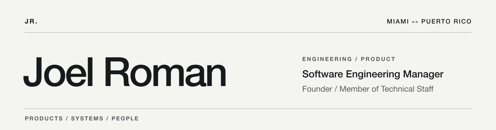

<picture>
  <source media="(max-width: 640px) and (prefers-color-scheme: dark)" srcset="./assets/joel-roman-banner-mobile-dark.png">
  <source media="(max-width: 640px)" srcset="./assets/joel-roman-banner-mobile-light.png">
  <source media="(prefers-color-scheme: dark)" srcset="./assets/joel-roman-banner-dark.png">
  
</picture>

# Joel “JR” Roman 👋🇵🇷

**Software Engineering Manager at GoodRx · Founder / Member of Technical Staff**  
Miami ↔ Puerto Rico · 14+ years building software

I currently lead an exceptionally talented mobile engineering team at GoodRx. We take initiative, own hard problems, and work to improve how people access and experience healthcare. I still build, with a background in native Android, developer tools, and product systems that includes Northrop Grumman. Alongside GoodRx, I'm Founder / Member of Technical Staff on the three ventures below.

> I turn recurring team problems into useful tools, then share what works.

## Building now

My role across all three: **Founder / Member of Technical Staff**.

### 01 / [FacturaOS](https://facturaos.com/)

**Business operations · Puerto Rico and the U.S.**  
A bilingual platform connecting estimates, invoices, customer records, and payment workflows. It is shaped around Puerto Rico's tax and payment practices, with a separate [U.S. operating market](https://facturaos.com/markets/united-states).

### 02 / [AlquilaOS](https://www.alquilaos.com/)

**Rental management · Puerto Rico**  
A bilingual workspace for landlords and tenants, bringing property and lease records, maintenance, and optional online payments into one flow.

### 03 / [Anacaona Studios](https://anacaonastudios.com/)

**Casual games · Caribbean roots**  
An independent studio creating casual adventures and fresh takes on familiar games. We design for players across generations, with older adults especially in mind. *Canoa: Golden Tide* is available on [iOS](https://apps.apple.com/us/app/canoa-golden-tide/id6810344411) and [Android](https://play.google.com/store/apps/details?id=com.anacaonastudios.canoa).

## Work you can inspect

| Project | What it shows |
| --- | --- |
| [commandline-ktx](https://github.com/joelromanpr/commandline-ktx) | A Kotlin library for building command-line tools. |
| [android-essentials](https://github.com/joelromanpr/android-essentials) | Small, focused Android libraries with published artifacts and documented APIs. |
| [tiny-compressor-ktx](https://github.com/joelromanpr/tiny-compressor-ktx) | Kotlin-first Android image compression with coroutine and Flow support. |
| [code-signing-game](https://github.com/joelromanpr/code-signing-game) | An interactive way to learn code-signing concepts. |

## Recognition & community

- Co-inventor of [U.S. Patent 11,188,964 B2, *Self-service merchandise request system*](https://patents.google.com/patent/US11188964B2/en).
- Recognized by Northrop Grumman's VP of Technology Sector for technology supporting Puerto Rico's Zika response.
- Former co-founder of Google Developer Group Puerto Rico; speaker and mentor in Puerto Rico and Miami tech communities.

## Writing

- [Stop Writing Boilerplate: A Modern Type-Safe Argument Parser for Kotlin](https://medium.com/@joelromanpr/stop-writing-boilerplate-a-modern-type-safe-argument-parser-for-kotlin-3b84403bf747)
- [Tiny but Mighty: Ship Reliable Downloads on Android with TinyDownloader, Kotlin & Coroutines](https://medium.com/@joelromanpr/tiny-but-mighty-ship-reliable-downloads-on-android-with-tinydownloader-kotlin-coroutines-826349e9b28e)
- [The Return of Ownership](https://x.com/joelromanpr_/status/2012979443619320082)

  
<strong>More from the workshop</strong>

I started with native Android and still enjoy making small tools that solve real problems. Earlier work includes [Android Puerto Rico MVVM](https://github.com/joelromanpr/android-puertorico-mvvm), [Flutter Puerto Rico MVVM](https://github.com/joelromanpr/flutter-puertorico-mvvm), [LoKi](https://github.com/joelromanpr/LoKi), an [ATH Móvil Android SDK](https://github.com/joelromanpr/athmovil-android-sdk), and a [Puerto Rico government data API](https://github.com/joelromanpr/pr-government-api). I also built the FocusZen and BudgetZen Android apps.

Away from product work, I'm exploring robotics, AI, and world models. I like teaching, coaching new builders, good science fiction, and Puerto Rico coffee.

---

**Let's connect:** [LinkedIn](https://www.linkedin.com/in/joelromanpr/) · [Medium](https://medium.com/@joelromanpr) · [GitHub](https://github.com/joelromanpr)
